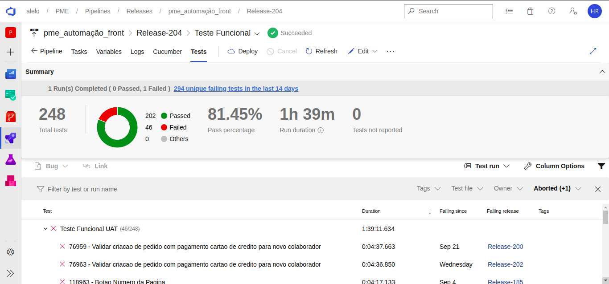
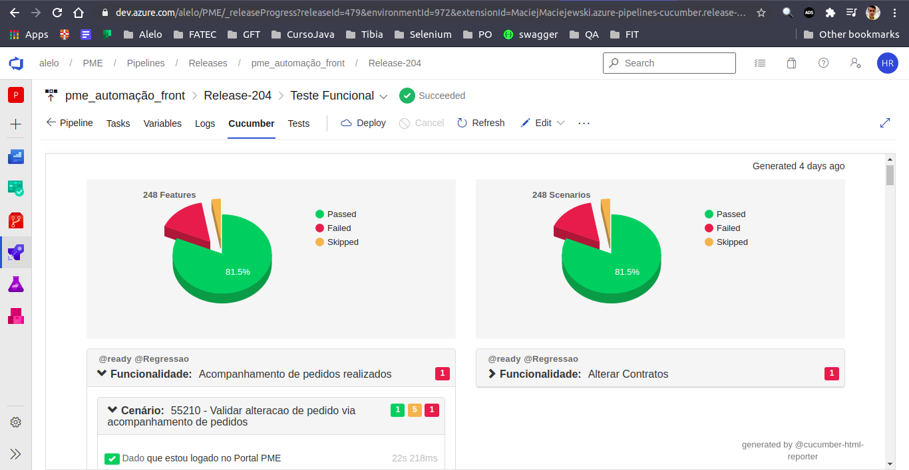
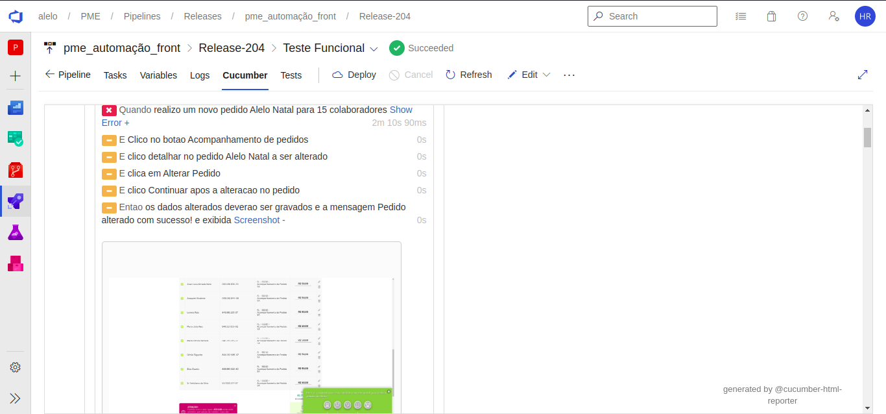
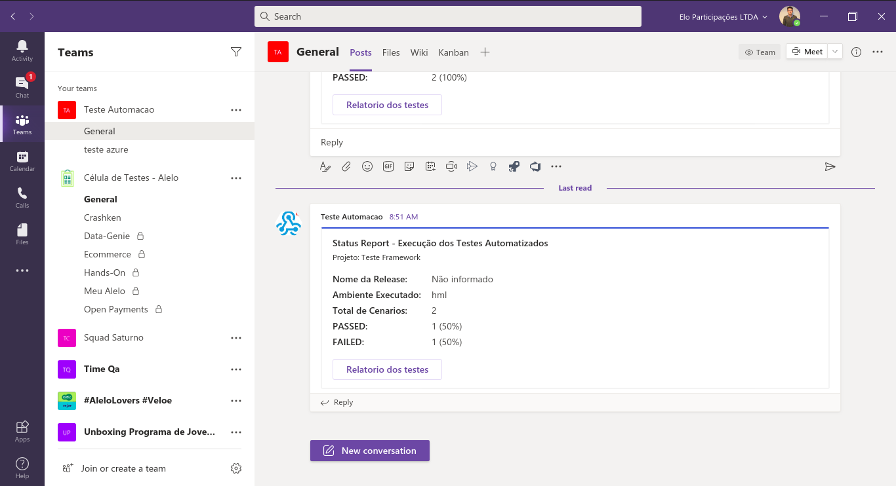

# Framework Alelo de testes automatizados de API's

**Esse projeto entrega, de maneira integrada com o Nexus, uma estrutura completa para automação de testes de API's, usando os melhores frameworks e práticas.**

Execução em Paralelo:


## Linguagens e Frameworks utilizados

O projeto utiliza as seguintes linguagens e frameworks:

* [Java 11](https://openjdk.java.net/projects/jdk/11/) linguagem usada para desenvolver o projeto
* [TestNG](https://testng.org/doc/) framework para Testes Unitários e para o suporte aos testes/cenários do Cucumber
* [JavaFaker](https://github.com/DiUS/java-faker) utilizado para a geração de massas randômicas
* [Alelo-Assured](https://dev.azure.com/adquirencia/Automacao/_git/Automacao?path=%2Falelo-selenium&version=GBhouseKeeping&_a=contents) essa é uma dependência desenvolvida pelo próprio time de QA da Alelo que centraliza e orquestra as seguintes dependências relacionadas ao Rest-Assured, podendo no futuro adicionar funcionalidades a este:
  * [Rest-Assured](https://rest-assured.io/) Rest-Assured é uma ferramenta que foi desenvolvida para facilitar a criação de testes automatizados para APIs REST. Esta oferece suporte para validar protocolo HTTP e requisições em JSON. 
* [Cucumber-Test](https://dev.azure.com/adquirencia/Automacao/_git/Automacao?path=%2Fcucumber%2Fcucumber-test&version=GBhouseKeeping&_a=contents) essa é uma dependência desenvolvida pelo próprio time de QA da Alelo que centraliza e orquestra as seguintes dependências/atividades:
  * [Cucumber-Java](https://cucumber.io/docs/installation/java/) Framework de suporte a BDD utilizando a linguagem Gherkin
  * [Cucumber-Junit](https://cucumber.io/docs/installation/java/) Framework de integração do Cucumber com o Junit
  * [Cucumber-Testng](https://cucumber.io/docs/installation/java/) Framework de integração do Cucumber com o TestNg
* [Plugin-Teams](https://dev.azure.com/adquirencia/Automacao/_git/Automacao?path=%2Fcucumber%2Fcucumber-plugins%2Fplugin-teams&version=GBhouseKeeping&_a=contents) plugin para o cucumber desenvolvido pelo time de QA da Alelo, envia um status dos testes executados para um Time no MS Teams
* [Plugin-Azure](https://dev.azure.com/adquirencia/Automacao/_git/Automacao?path=%2Fcucumber%2Fcucumber-plugins%2Fplugin-azure&version=GBhouseKeeping&_a=contents) plugin para o cucumber desenvolvido pelo time de QA da Alelo, atualiza o status do test case dentro do Azure Test Plan


## Arquitetura dos Testes

Esse projeto tem o intuito de acelerar e facilitar a criação de uma boa arquitetura para seus testes automatizados.
Ele deve ser usado como abordagem inicial, para a construção de testes automatizados com entregas mais rápidas, simples e eficiente.

Nesse projeto você verá as seguintes arquiteturas e design patterns:

* [Service Objects pattern](#service-objects-pattern)
* [Execução em Paralelo](#execuo-em-paralelo)
* [Cucumber](#Cucumber)
* [Arquivos de Configuração](#arquivos-de-configurao)
* [Fabrica de Massas de Dados](#fabricas-de-massa-de-dados)
* [Pipeline as a code](#pipeline-as-a-code)

Você possui algum item que gostaria de acrescentar na nossa arquitetura? Por favor, faça um Pull Request para discutirmos.

### Services Objects pattern
Resumidamente:
Service Object Model nos permite criar um repositório de objetos com elementos contidos em um Endpoint.
Sob este modelo, para cada endpoint, deve haver uma classe correspondente.
Esta classe obtém e classifica os elementos da request e response e também pode conter métodos que executam operações nesses elementos. 

#### POJO's
Afim de tornar o trabalho com esses os serviços ainda mais produtivo, podemos estruturar esses serviços como POJOS(Plain Java Objects) utilizando ainda o suporte da Depedencia Jackson.fastexml para serializar esses Objetos
somando isso ao fato de que podemos utilizar site abertos para transformas nossos payloads nesses Objetos(e.g. http://www.jsonschema2pojo.org/), temos uma arquitetura que além de enxuta e de facil utilização, torna-se robusta.

### Execução em Paralelo
A Execução em paralelo é baseada nas execuções em paralelo do TestNG: [parallel tests](https://testng.org/doc/documentation-main.html#parallel-tests)
podemos especificar o número de Threads e se devemos rodar em paralelo ou não de algumas maneiras:
1. Dentro da classe RunCucumberTests podemos colocar o valor da propriedade @DataProvider(parallel = false/true)
2. Outra maneira é deixar a propriedade parallel da classe RunCucumberTests sempre true, e passar o número de Threads desejadas via Maven:
   ``` bash
     mvn clean verify -Ddataproviderthreadcount=1
     ```
3. Podemos ter um arquivo do tipo .xml para especificar como a `suite` para o TestNG
  * No caso de optar por informar a suíte do teste, devemos também informar o caminho para a suite via o comando

OBS: Por padrão as execuções em paralelo serão baseadas nos Métodos, ou seja, nos cenários escritos em Gherkin, porém,
isso pode ser alterado via arquivo pom ou suite:
```xml
<configuration>
   <!-- Exemplo para rodar baseado em classe, ou seja Runners -->
   <parallel>classes</parallel>
</configuration>
```
### Cucumber
Esse projeto foi construído com base na arquitetura especificada pela própria cucumber, e foi feito dessa maneira para
suportar de maneira eficiente o desenvolvimento orientado a comportamento(BDD), além disso, o uso do cucumber nos fornece algumas funcionalidades extras:
* Reports com linguagem natural e logs:
  * Possuimos um Report padrão com a identidade visual da Alelo, que usa a biblioteca [Cluecumber](https://github.com/trivago/cluecumber-report-plugin)
   ele será gerado sempre que os testes forem executado via Maven, e usa o arquivo `custom.css` e o arquivo `cucumber.json` gerado pelo cucumber,
    de acordo com as propriedades relacionadas aos Prints esses estarão presentes no Report.
  * Também possuímos dois Reports que são gerados no próprio Azure Pipelines:
      * Report padrão do Azure que faz o uso do arquivo `junit.xml`, também gerado pelo cucumber 
      * Report Cucumber para o Azure, que faz o uso do arquivo `cucumber.json` gerado pelo cucumber  
* Plugins de integração:
  * Como já descrito acima, possuímos dois plugins, para o cucumber, de integração com as seguintes ferramentas:
      * 
      * 
      
### Arquivos de Configuração
Os plugins do cucumber utilizados pelo projeto também precisam de algumas informações contidas em arquivos de propriedades, que devem ficar localizados em `src/test/java/resources/`:
* `azure.properties`: contem as informações necessarias para integrar a automação ao Azure Test Plan(atualizar o status dos casos de testes) e se deve ser atualizado ou não(update.test.plan)
* `teams.properties`: contem as informações necessarias para integrar a automação ao MS Teams(enviar resultado da automação para o Teams do seu time) e se o resultado deve ser enviado ou não(send.results)

### Pipeline as a code
O projeto já possui um arquivo de exemplo, `azure-pipeline.yml` utilizado pelo Azure Pipelines para configura-la.